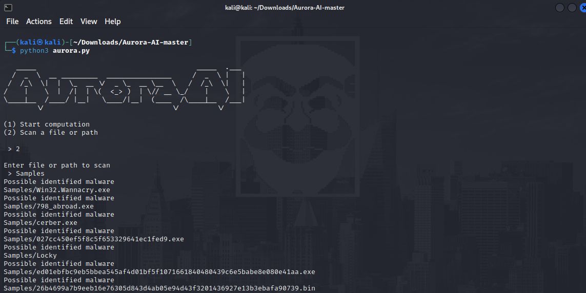

# Aurora-Ai
## Use Ai to find malwares on your system

## Notes
- Let Aurora learn the characteristics of malwares by using ligistic regression
- Aurora will do its computation based on data taken from ~47,000 legitimate and non-legitimate files.
- After it has finished you may let it scan a path (or a specific file).
- Aurora will go over all the files in the chosen path and alert if it thinks there is a possible malware.
- In its current state Aurora has quiet a lot of false-positives. 
- Tested on some of the latest known ransomwares including WannaCry, Locky and Petya
- Testing was done on malwares taken from the zoo repo - https://github.com/ytisf/theZoo

## Demo screenshot 

